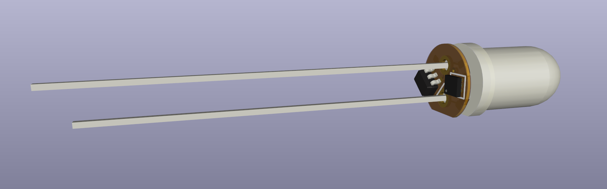
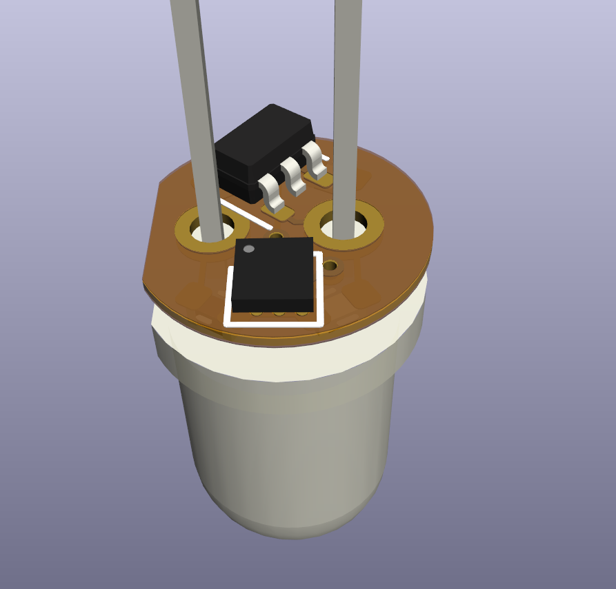
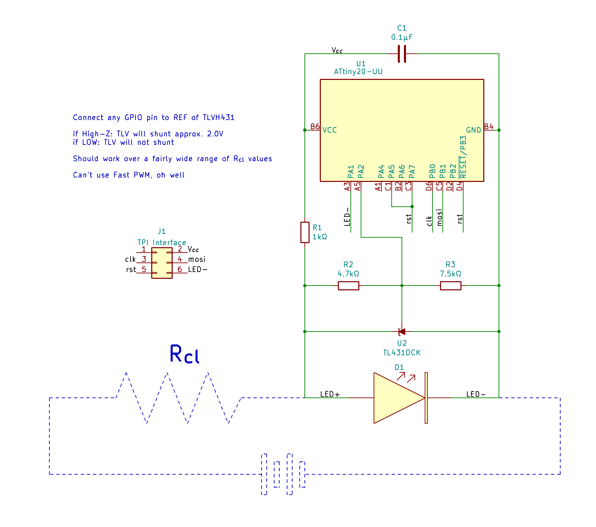
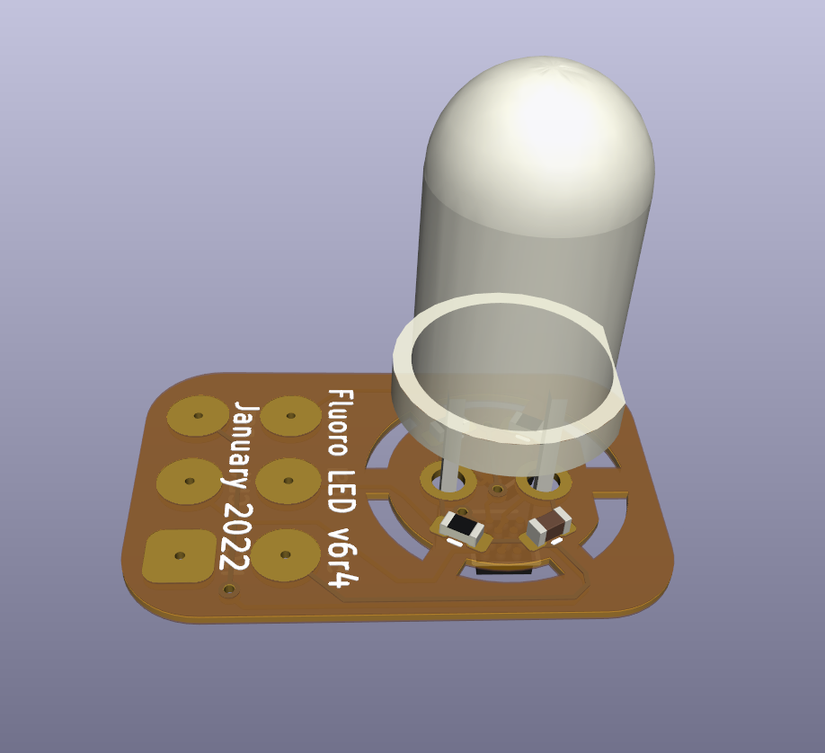

# A different interpretation of "programmable LED"

TL;DR I'm investigating if I can attach a very very small circuit to a through-hole LED to run a custom programmed pattern, similar to a candle-flicker LED.

## The Concept

A flicker LED is an LED that flickers. More specifically, it is a _drop-in replacement_ for a conventional LED—no need to change the current-limiting resistor, no new calculations for forward voltages, it works just the same as a conventional LED. And they're cheap, too! If you want an LED that flickers like a candle (or one that blinks at a set frequency and duty cycle) you are set for life.

But what if you want a different LED light pattern? In my specific case, I want an LED that turns on like a struggling fluorescent bulb. Or one that stays off most of the time, then suddenly lights up the room like lightning. Or a pseudo-status LED that blinks at random frequencies to trick the viewer into thinking some complex process is running. Or...anything, really. A programmable LED!

Do programmable LEDs like this exist? Obviously the WS2812b and similar LEDs exist, and those are frequently called "programmable LEDs". But those are pretty different than, say, a flicker LED. You still need a controller of some variety to tell the WS2812b what pattern to perform, which is not the case for a flicker LED, and not the case for the LEDs I'm envisioning.

## The Circuit

So can it be done? Without designing a custom IC and embedding it in a custom LED casing? I need a solution compatible with a stock LED. And that means the solution needs to exist _in parallel with the LED_. I'm envisioning a small PCB nestled underneath a 5mm through-hole LED. Soldered in place between the existing legs, no cuts or modifications to the LED itself.

What microcontroller is small enough to fit under a 5mm through-hole LED? I know of two: the WLCSP-12 ATtiny20 (1.55×1.43 mm) and the WLP-16 MAX32660 (1.55×1.57 mm). It's true that I've been meaning to get better with ARM systems, but for now I'll stick with the more familiar AVR-based ATtiny20.

Both those microcontrollers require at least 1.8V to operatre. A white LED drawing between 1 and 20 mA will have a forward voltage in roughly the 2.4 - 3.1 V range. That means a microcontroller in parallel can be powered while the LED is on! However, if the LED shuts off, the voltage across it drops to 0V and the microcontroller will shut off as well. To get around this, we can make the LED super dim instead of completely turned off. If we use a shunt to get the LED forward voltage into the 1.8 - 2.0 V range, the microcontroller can stay on while the LED light output is undetectable. A TLVH431 adjustable shunt lets us keep the same forward voltage, regardless of if the shunt is carrying 1 mA or 20 mA, which makes things more consistent than a Zener diode can do.

My original plan was to shunt current around the LED using a BJT driven by an I/O pin on the microcontroller. This would be paired with a Zener diode to keep the LED voltage at at least 1.8V, to ensure the microcontroller has enough power. There were some issues with this approach! For one thing, I learned that low-value Zeners have much more variation in their breakdown voltages. A diode sold as a 1.8V Zener might, at a current of 10 mA, have a breakdown voltage closer to 2.6V; this wouldn't dim the LED at all!

Another issue is the transistor. I didn't realize that I could sink ~20 mA directly into these microcontrollers' GPIO pins! In fact, the ATtiny20 GPIO can source/sink 40 mA, and the MAX32660 can do 25. This means the current being diverted around the LED can go through the microcontroller, instead of an external transistor. Thank you to [cpldcpu](https://cpldcpu.wordpress.com) for pointing this out to me! I don't know what led me to think that a BGA ATtiny could handle less current than SOIC or DIP equivalents. That set off a cascade of design adjustments that led to the current very-low-component-count design.

## Putting it together

This seems really plausible! [Here is a tweet showing the circuit working as expected with larger versions of each part](https://twitter.com/DHammarskjold/status/1483334537580998658). The flicker animation is a port of one kindly provided by [Emily Velasco](https://twitter.com/MLE_Online), which you can obtain in the `code/` folder. According to my cheap ammeter, the microcontroller functions properly on a supply as low as 0.5 mA and as high as 20 mA, which I'm thrilled to see.

Programming a 1.5mm IC is always a fun challenge, isn't it? My current (untested) plan is to order the PCBs nestled inside a larger PCB with pogo-pin programming pads, like so:

I should be able to reflow-solder the ATtiny20 and TLVH431, then program the microcontroller, then hand-solder the passives, then snip the board free, *then* attach the LED.

In the meantime, please let me know if I've overlooked some aspect or if you have any ideas on how to change/improve this. I have a few ideas for a 5mm RGB LED, but that's a project for another time....